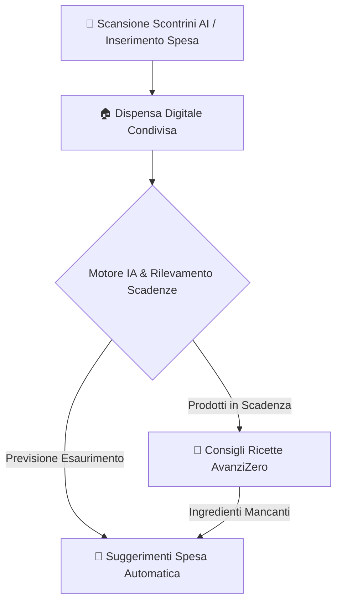
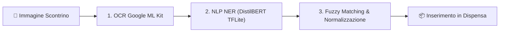
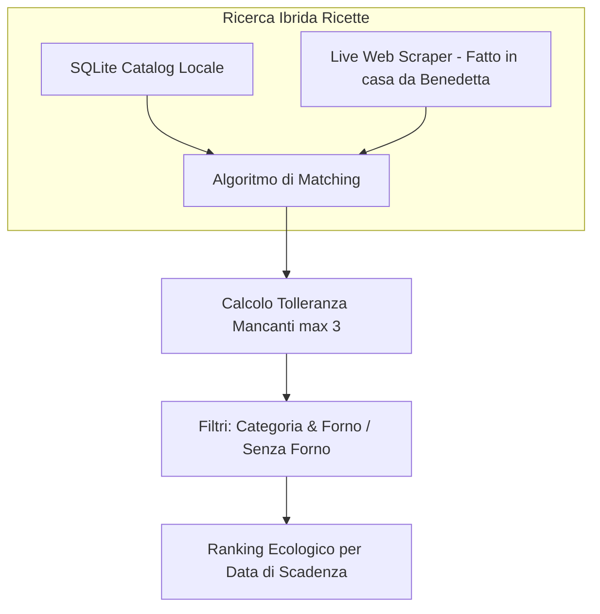

# 🏠 FarFromHome (AvanziZero) 🍲

<div align="center">
  
  <h3>Gestione Intelligente della Dispensa, Spesa Condivisa e Cucina a Zero Spreco per Studenti e Coinquilini</h3>
  <p><i>Un'applicazione Flutter all'avanguardia alimentata da IA Ibrida Locale (DistilBERT TFLite), Motore Statistico Predittivo e Live Web Harvesting 100% Token-Less.</i></p>
</div>

---

## 🌟 Indice
- [Panoramica e Missione](#-panoramica-e-missione)
- [Architettura dell'Intelligenza Artificiale (Edge Computing)](#-architettura-dellintelligenza-artificiale-edge-computing)
  - [1. Scansione Scontrini: NLP Ibrido a 3 Stadi (BERT + Fuzzy)](#1-scansione-scontrini-nlp-ibrido-a-3-stadi-bert--fuzzy)
  - [2. Motore Predittivo Comportamentale](#2-motore-predittivo-comportamentale)
- [🍲 Motore Ricette & "Grandissimo Retrieve" Live](#-motore-ricette--grandissimo-retrieve-live)
  - [Scraping Esteso & JSON-LD Parsing (Fatto in Casa da Benedetta)](#scraping-esteso--json-ld-parsing-fatto-in-casa-da-benedetta)
  - [Filtri Avanzati & "Senza Forno"](#filtri-avanzati--senza-forno)
- [💎 Punti di Forza ed Ecosistema](#-punti-di-forza-ed-ecosistema)
- [📁 Struttura del Progetto](#-struttura-del-progetto)
- [💻 Requisiti e Installazione](#-requisiti-e-installazione)

---

## 🚀 Panoramica e Missione

**FarFromHome (AvanziZero)** nasce per rivoluzionare la gestione domestica di studenti fuorisede, coinquilini e famiglie. Coordinare la spesa, tenere traccia delle scadenze e decidere cosa cucinare con i rimasugli in frigo diventa un'esperienza fluida, automatizzata e coinvolgente.

La nostra missione è **#AvanziZero**: azzerare lo spreco alimentare sfruttando algoritmi di intelligenza artificiale eseguiti direttamente sul dispositivo, garantendo massime prestazioni, totale privacy e l'assoluta indipendenza da costosi servizi cloud o chiavi API a pagamento.



---

## 🧠 Architettura dell'Intelligenza Artificiale (Edge Computing)

Tutta l'infrastruttura di Intelligenza Artificiale è stata modularizzata ed è situata sotto il modulo dedicato `flutter_app/lib/services/ia/`, operando in modalità **Edge Computing** (elaborazione on-device).

### 1. Scansione Scontrini: NLP Ibrido a 3 Stadi (BERT + Fuzzy)
L'importazione automatica degli scontrini fotografati non si affida a un semplice OCR grezzo, ma utilizza un'avanzata pipeline ibrida orchestrata in `AIScannerService`:



1. **STADIO 1 - OCR (Google ML Kit Text Recognition):** Riconoscimento e frammentazione visiva dello scontrino in righe di testo grezzo.
2. **STADIO 2 - NLP Tokenization & NER (TensorFlow Lite):** Tramite un tokenizer personalizzato (`WordPieceTokenizer`) e un modello neurale compatto **DistilBERT** (`receipt_ner_distilbert.tflite`), ogni riga viene destrutturata in sub-tokens e classificata in 4 etichette NER:
   - `B-PROD` / `I-PROD`: Inizio e continuazione di un prodotto alimentare.
   - `B-QTY`: Quantità acquistata.
   - `O`: Testo irrilevante (prezzi, codici, indirizzi).
3. **STADIO 3 - Correzione Fuzzy & Post-Processing:** I testi estratti passano al `LocalReceiptParser`, che corregge istantaneamente gli errori di lettura OCR (es. trasformando _"M3LA"_ in _"Mela"_) abbinando categoria, icona e scadenza stimata in base allo storico.

### 2. Motore Predittivo Comportamentale
Per suggerire cosa acquistare prima di rimanere senza scorte, abbiamo implementato un **motore algoritmico locale** (`SmartPantryAI` e `LocalPredictiveModel`) che apprende in tempo reale dalle abitudini del gruppo:

- **Decadimento Temporale Esponenziale (Time Decay):** I consumi passati vengono ponderati con un peso esponenziale ($e^{-0.05 \times \text{DaysAgo}}$). Un consumo recente ha valore massimo, mentre i consumi vecchi perdono peso, catturando automaticamente stagionalità e cambi di dieta.
- **Scarcity Ratio & Frequenza:** Calcola la distanza media in giorni tra gli acquisti e l'indice di esaurimento in base al numero di coinquilini (`groupSize`).
- **Reinforcement Feedback Loop:** L'IA adatta la propria confidenza in base alle risposte dell'utente. I suggerimenti accettati guadagnano confidenza (con inserimento automatico dopo >3 accettazioni), mentre i consigli rifiutati perdono punteggio fino a entrare in una blacklist temporanea.
- **Explainable AI (XAI):** Ogni suggerimento include il motivo trasparente della predizione (es. _"Esaurimento imminente"_ o _"Frequenza di acquisto: comprato ogni ~5 giorni"_).

---

## 🍲 Motore Ricette & "Grandissimo Retrieve" Live

L'app risolve il problema del "cosa cucino stasera?" massimizzando l'uso di ciò che è già presente in casa, espandendo la varietà di ricette a livelli senza precedenti:



### Scraping Esteso & JSON-LD Parsing (Fatto in Casa da Benedetta)
- **100% Benedetta:** Su richiesta specifica, per garantire massima qualità, ricchezza di ingredienti e aderenza alla tradizione culinaria italiana, il motore si concentra interamente sul sito *Fatto in casa da Benedetta*.
- **"Grandissimo Retrieve" (Batch Harvesting):** Il `LiveRecipeHarvestingService` implementa una solida architettura di estrazione asincrona a lotti (batching a blocchi di 5) per mappare capillarmente l'intero sito senza incorrere in blocchi server o rate-limiting (HTTP 429).
- **DOM & JSON-LD Processing:** Il motore legge nativamente l'HTML e i dati strutturati `application/ld+json`, estraendo in tempo reale foto, procedimenti accurati (formattati splendidamente tramite espressioni regolari per isolare ogni passaggio in nuove righe pulite `1.`, `2.`) e valori anagrafici esatti.
- **Zero API Keys:** Nessuna chiave Google API o servizio esterno a pagamento. Tutto avviene in locale sul dispositivo in modo trasparente e ultra-veloce.

### Filtri Avanzati & "Senza Forno"
- **Ranking Ecologico (AvanziZero):** Il `RecipeMatcherService` mette in cima alla lista le ricette che utilizzano i prodotti in dispensa più vicini alla scadenza (o già scaduti), seguiti dal minor numero di ingredienti mancanti (massimo 3 di tolleranza) e dal minor tempo di preparazione.
- **Sincronia Filtri Live / SQLite:** Sia nella modalità catalogo dispensa che in quella di scoperta casuale (pulsante dadi), il sistema applica filtri rigorosi in tempo reale. Selezionando **"Senza Forno"**, tutte le ricette che richiedono il forno (`withOven == true`) vengono scartate a monte prima di qualsiasi campionamento, garantendo raccomandazioni impeccabili.
- **Categorizzazione Precisa:** Disambiguazione intelligente basata su URL e keyword per impedire che ricette dolci finiscano per errore tra i Primi Piatti o viceversa.

---

## 💎 Punti di Forza ed Ecosistema

```
 ┌─────────────────────────────────────────────────────────┐
 │                  FARFROMHOME ECOSISTEMA                 │
 ├────────────────────────────┬────────────────────────────┤
 │ ⚡ 100% Token-Less         │ Nessuna API a pagamento    │
 ├────────────────────────────┼────────────────────────────┤
 │ 🔒 Assoluta Privacy        │ AI eseguita su Smartphone  │
 ├────────────────────────────┼────────────────────────────┤
 │ 📶 Zero Downtime Fallback  │ Funziona Offline & Online  │
 ├────────────────────────────┼────────────────────────────┤
 │ 🎯 UI Premium & Native     │ Glassmorphism & HeaderMenu │
 └────────────────────────────┴────────────────────────────┘
```

- **Banner Dinamici Connessione:** Transizione fluida e avvisi non intrusivi in caso di perdita o ripristino della connettività, con fallback immediato su SQLite integrato.
- **UI Moderna:** Menu orizzontali ad accesso rapido (`HorizontalHeaderMenu`), card smussate in stile Glassmorphism, espansioni animate (`AnimatedSize`) e pulsanti contestuali per l'aggiunta istantanea alla spesa o la navigazione rapida ai siti sorgente.

---

## 📁 Struttura del Progetto

```
FarFromHome/
├── flutter_app/                     # Applicazione principale Flutter
│   ├── assets/
│   │   ├── ai_models/               # Modello neurale DistilBERT TFLite e Vocabolario
│   │   └── db/recipes_catalog.db    # Database SQLite curato di base
│   ├── lib/
│   │   ├── models/                  # AppState, ItemModel, UserModel
│   │   ├── screens/                 # Interfacce UI (RecipesScreen, PantryScreen, ShoppingScreen, ecc.)
│   │   ├── services/
│   │   │   ├── ia/                  # Modulo IA Core: AIScanner, LocalReceiptParser, RecipeMatcher, SmartPantry
│   │   │   ├── auth_service.dart
│   │   │   ├── firebase_service.dart
│   │   │   └── live_recipe_harvesting_service.dart # Scraping Engine Live
│   │   ├── theme/                   # AppColors e Tipografia
│   │   └── widgets/                 # Componenti riutilizzabili (HorizontalHeaderMenu, OCR Modal...)
│   └── pubspec.yaml                 # Configurazione dipendenze Flutter
├── scripts/                         # Script Python per generazione DB (build_recipe_db.py)
└── README.md                        # Documentazione Architetturale (Questo file)
```

---

## 💻 Requisiti e Installazione

1. **Requisiti di Sistema:**
   - [Flutter SDK](https://flutter.dev/) (versione stabile recente, 3.x)
   - Dispositivo Android/iOS o Emulatore configurato
   - Python 3.x (opzionale, per rigenerare il catalogo SQLite di base)

2. **Clonazione e Build:**
   ```bash
   # 1. Clona il repository
   git clone https://github.com/YuliaD2609/FarFromHome.git
   cd FarFromHome/flutter_app

   # 2. Scarica le dipendenze
   flutter pub get

   # 3. Verifica l'integrità del codice
   flutter analyze

   # 4. Avvia l'applicazione sul dispositivo
   flutter run
   ```

---

<div align="center">
  <p><i>Made with ❤️ by the FarFromHome Engineering Team. Insieme verso lo #AvanziZero!</i></p>
</div>
