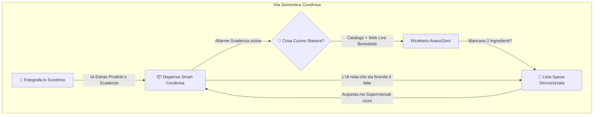
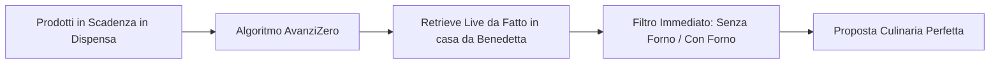

# 🏠 FarFromHome (AvanziZero) 🍲

<div align="center">
  
  <h3>La Prima Super-App per Studenti Fuorisede e Coinquilini: Spesa Condivisa, Dispensa Intelligente e Cucina a #AvanziZero</h3>
  <p><i>Gestisci la casa in armonia, risparmia tempo e denaro, azzera gli sprechi alimentari e scopri migliaia di ricette perfette per ciò che hai in frigo.</i></p>
</div>

---

## 🌟 Indice
- [💡 Il Problema & La Soluzione](#-il-problema--la-soluzione)
- [📱 Esplorazione delle Funzionalità Chiave](#-esplorazione-delle-funzionalità-chiave)
  - [📦 1. La Dispensa Smart & Condivisa](#1-la-dispensa-smart--condivisa)
  - [📸 2. Importazione Magica Scontrini con IA On-Device](#2-importazione-magica-scontrini-con-ia-on-device)
  - [🛒 3. Lista della Spesa Sincronizzata & Suggerimenti Intelligenti](#3-lista-della-spesa-sincronizzata--suggerimenti-intelligenti)
  - [🍲 4. Ricettario #AvanziZero & Il "Grandissimo Retrieve" dal Web](#4-ricettario-avanzizero--il-grandissimo-retrieve-dal-web)
  - [👥 5. Gestione Gruppi & Coinquilini](#5-gestione-gruppi--coinquilini)
  - [📍 6. Radar Supermercati Vicini](#6-radar-supermercati-vicini)
  - [👑 7. Modalità Premium & Personalizzazioni](#7-modalità-premium--personalizzazioni)
- [🌿 L'Impatto Ambientale e Sociale (#AvanziZero)](#-limpatto-ambientale-e-sociale-avanzizero)
- [🛡️ L'Esperienza Utente: Offline-First e Privacy Totale](#-lesperienza-utente-offline-first-e-privacy-totale)
- [💻 Guida all'Installazione per Sviluppatori](#-guida-allinstallazione-per-sviluppatori)

---

## 💡 Il Problema & La Soluzione

### ❌ La tipica vita da fuorisede / coinquilini:
- **Il Frigo del Mistero:** Alimenti dimenticati in fondo ai ripiani che scadono regolarmente, gettando via soldi e cibo prezioso.
- **Acquisti Doppi o Dimenticati:** *"Chi doveva comprare il latte?" "Pensavo l'avessi preso tu!"* - Risultato: due pacchi di burro e niente pasta.
- **La Fatica degli Scontrini:** Inserire manualmente ogni singolo prodotto acquistato in fogli Excel o appunti sul telefono è un'attività tediosa che tutti abbandonano dopo pochi giorni.
- **Il Dilemma Serale:** *"Cosa cuciniamo stasera con mezza zucchina, un uovo e del tonno?"* - Trovare ricette adatte richiede ore di ricerca su Google tra pubblicità e ingredienti irreperibili.

### ✨ La Soluzione: FarFromHome (AvanziZero)
**FarFromHome** trasforma radicalmente l'esperienza della convivenza e della gestione alimentare. Un'unica applicazione dal design mozzafiato (Glassmorphism, menu fluidi e avvisi nativi) che unisce la comunicazione del gruppo, l'intelligenza artificiale per l'acquisizione automatica dei prodotti e un motore di ricette in grado di pescare da internet l'ispirazione perfetta per svuotare il frigo senza sprecare una singola foglia di insalata.

---

## 📱 Esplorazione delle Funzionalità Chiave



### 1. La Dispensa Smart & Condivisa
La tua cucina digitale, sempre in tasca e perfettamente organizzata.

* **Indicatori Visivi di Freschezza:** Ogni prodotto è accompagnato da un badge dinamico colorato. Vedi a colpo d'occhio cosa è fresco (🟢), cosa va consumato a breve (🟡) e cosa è in scadenza critica (🔴).
* **Organizzazione per Categorie:** Frutta, Latticini, Carni, Lievitati, Dispensa Secca. Filtra e cerca i prodotti istantaneamente grazie alla comoda barra di navigazione orizzontale (`HorizontalHeaderMenu`).
* **Sincronizzazione in Tempo Reale:** Qualsiasi coinquilino aggiunga, modifichi o consumi un prodotto, l'intera casa vede la variazione istantaneamente.

---

### 2. Importazione Magica Scontrini con IA On-Device
Dimentica l'inserimento manuale. Quando torni dal supermercato, ti basta scattare una foto allo scontrino.

* **Comprensione Immediata del Testo:** L'app utilizza un sofisticato modello neurale integrato sul telefono (`DistilBERT` in TFLite) in grado di leggere e destrutturarlo in frazioni di secondo.
* **Correzione degli Errori OCR:** Lo scontrino dice *"MLK PARZ SCR 1L"*? L'intelligenza artificiale di FarFromHome capisce automaticamente che si tratta di *"Latte Parzialmente Scremato"*, gli assegna l'icona 🥛, la categoria *Latticini* e calcola la data di scadenza tipica.
* **Divisione e Assegnazione:** Inserisci intere spese mensili nella dispensa di gruppo in meno di 5 secondi.

---

### 3. Lista della Spesa Sincronizzata & Suggerimenti Intelligenti
Fai la spesa in perfetta coordinazione, senza dimenticare nulla o fare doppioni.

* **Lista Collaborativa Live:** Aggiungi un prodotto alla lista e i tuoi coinquilini lo vedranno comparire in tempo reale mentre sono corsia per corsia al supermercato.
* **Motore Predittivo Comportamentale:** L'app impara le abitudini di consumo della casa! Se il gruppo beve in media 4 litri di latte a settimana, l'app noterà l'esaurimento imminente e ti suggerirà nella lista: *"Consigliato: Latte (Esaurimento imminente, acquistato ogni ~5 giorni)"*.
* **Feedback Intelligente:** L'IA si adatta a voi. Accetta o rifiuta i suggerimenti per calibrare l'algoritmo sulle vostre reali preferenze alimentari.

---

### 4. Ricettario #AvanziZero & Il "Grandissimo Retrieve" dal Web
Il vero cuore pulsante dell'applicazione. Non dovrai mai più chiederti *"cosa mangiamo stasera?"*.



* **Ranking Ecologico (Salviamo la Cena):** Il sistema analizza la tua dispensa e ordina le ricette mettendo al **primo posto** i piatti che sfruttano esattamente gli ingredienti che stanno per scadere in frigo!
* **Il "Grandissimo Retrieve" da Fatto in Casa da Benedetta:** Per offrire un catalogo di altissima qualità, profondamente legato alla tradizione culinaria italiana e ricchissimo di ingredienti, l'app interroga in tempo reale l'enorme archivio di *Fatto in casa da Benedetta*. Un avanzato motore di scraping asincrono a blocchi estrae foto ad alta definizione, tempi di cottura e procedimenti formattati in modo impeccabile, passo dopo passo.
* **Modalità "Senza Forno" & Filtri Istantanei:** Sei in un monolocale senza forno o fa troppo caldo per accenderlo? Attiva l'interruttore **"Senza Forno"**. Immediatamente, sia il database locale che il live scrapper filtreranno ed escluderanno qualsiasi ricetta richieda l'uso del forno, offrendoti solo soluzioni in padella, al vapore o a freddo.
* **Generatore Casuale (Pulsante Dadi 🎲):** Cerchi ispirazione pura? Tocca i dadi per compiere una ricerca esplorativa fulminea nel web e ricevere una selezione di 50 nuove idee culinarie a rotazione!
* **Tolleranza Ingredienti & Carrello Veloce:** Ti piace una ricetta ma ti mancano 2 o 3 ingredienti? Nessun problema! L'app ti mostra esattamente cosa manca e ti offre un comodo pulsante *"Aggiungi i 2 mancanti alla Spesa"*. Con un singolo tap, gli ingredienti finiscono nella lista della spesa sincronizzata del gruppo.
* **Link Diretto alla Sorgente:** Se desideri approfondire o leggere i commenti della community web, il pulsante *"Vai al sito della ricetta"* ti catapulta istantaneamente sulla pagina ufficiale del piatto.

---

### 5. Gestione Gruppi & Coinquilini
Convivere non è mai stato così rilassante.

* **Creazione Stanze/Appartamenti:** Crea il tuo "Appartamento Via Roma 12" e invita i coinquilini tramite un semplice link o codice.
* **Ripartizione Proprietà:** Assegna gli alimenti a "Tutti" per i beni comuni (olio, sale, spezie) o al singolo utente per i prodotti personali (il latte di soia di Marco, lo yogurt proteico di Sara).
* **Notifiche di Attività:** Ricevi avvisi quando qualcuno va a fare la spesa o inserisce un nuovo scontrino.

---

### 6. Radar Supermercati Vicini
Hai bisogno di un ingrediente urgente per completare una ricetta?

* **Esplorazione Mappa Integrata:** Visualizza all'istante i supermercati, minimarket e alimentari più vicini alla tua posizione attuale.
* **Calcolo della Distanza:** Scopri gli orari e il percorso più veloce per raggiungerli senza saltare da un'app all'altra.

---

### 7. Modalità Premium & Personalizzazioni
Sblocca l'accesso alle funzionalità élite di FarFromHome.

* **Temi Esclusivi e Dark Mode Elegante:** Personalizza l'interfaccia con accenti cromatici unici e gradienti premium in stile Glassmorphism.
* **Badge Profilo e Statistiche Avanzate:** Ottieni report dettagliati su quanto cibo hai salvato dallo spreco, l'andamento del tuo risparmio mensile e le statistiche di consumo del gruppo.

---

## 🌿 L'Impatto Ambientale e Sociale (#AvanziZero)

Lo spreco alimentare domestico rappresenta una delle più grandi sfide ecologiche ed economiche contemporanee. Per uno studente fuorisede o un lavoratore, gettare cibo significa perdere centinaia di euro ogni anno.

**FarFromHome** affronta il problema alla radice con un approccio gamificato ed educativo:
1. **Consapevolezza Visiva:** La barra colorata delle scadenze trasforma la gestione del frigo in un obiettivo quotidiano.
2. **Valorizzazione degli Avanzi:** Non esiste rimasuglio che non possa diventare un piatto delizioso grazie al motore di ricerca integrato.
3. **Risparmio Effettivo:** Meno cibo sprecato equivale a una lista della spesa più efficiente e a un portafoglio più sereno.

---

## 🛡️ L'Esperienza Utente: Offline-First e Privacy Totale

Abbiamo ingegnerizzato FarFromHome per essere incredibilmente snello, etico e resiliente:

* **⚡ Nessun Abbonamento Esterno (100% Token-Less):** A differenza di altre app che si appoggiano ad AI cloud costose (con API keys a pagamento), la nostra pipeline di intelligenza artificiale gira interamente sul processore del tuo smartphone.
* **🔒 Massima Privacy:** I tuoi scontrini, le tue spese e le tue abitudini alimentari non vengono vendute a inserzionisti terzi o elaborate in server remoti sconosciuti.
* **📶 Funzionamento Impeccabile Offline:** Sei al supermercato dove il telefono non prende? Nessun problema! Un elegante banner animato ti informerà del passaggio in modalità offline. L'app continuerà a operare alla massima velocità appoggiandosi a un ricco catalogo SQLite integrato, per poi sincronizzarsi in modo trasparente e silente col cloud non appena riavrai la connessione.

---

## 💻 Guida all'Installazione per Sviluppatori

Vuoi testare l'app o contribuire allo sviluppo? Ecco come configurare l'ambiente di lavoro:

1. **Requisiti di Sistema:**
   - [Flutter SDK](https://flutter.dev/) (versione stabile recente, 3.x)
   - Emulatore Android/iOS o dispositivo fisico configurato per il debug
   - Git per il controllo di versione

2. **Procedura di Build:**
   ```bash
   # 1. Clona il repository ufficiale
   git clone https://github.com/YuliaD2609/FarFromHome.git
   cd FarFromHome/flutter_app

   # 2. Ottieni le dipendenze del progetto
   flutter pub get

   # 3. Verifica l'assenza di errori di sintassi e linting
   flutter analyze

   # 4. Compila ed esegui l'app sul tuo dispositivo
   flutter run
   ```

---

<div align="center">
  <p><i>Made with ❤️ by the FarFromHome Engineering Team. Insieme verso lo #AvanziZero!</i></p>
</div>
