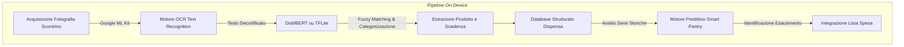
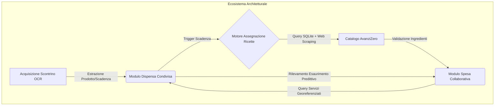

# AvanziZero

<div align="center">
  
  <h3>Sistema Integrato per la Gestione Collaborativa della Dispensa e l'Abbattimento dello Spreco Alimentare</h3>
  <p><i>Applicazione mobile sviluppata in Flutter per l'inventario domestico, l'estrazione OCR degli scontrini e il recupero in tempo reale di ricette mirate al riutilizzo degli avanzi in scadenza.</i></p>
</div>

---

## Indice
- [Contesto Operativo e Specifiche del Problema](#contesto-operativo-e-specifiche-del-problema)
  - [Dinamiche Sociali ed Economiche](#dinamiche-sociali-ed-economiche)
  - [Limiti delle Soluzioni Tradizionali](#limiti-delle-soluzioni-tradizionali)
- [Architettura di Intelligenza Artificiale](#architettura-di-intelligenza-artificiale)
  - [Estrazione OCR e Analisi Semantica (DistilBERT)](#estrazione-ocr-e-analisi-semantica-distilbert)
  - [Motore Predittivo Comportamentale (Smart Pantry AI)](#motore-predittivo-comportamentale-smart-pantry-ai)
- [Moduli e Funzionalità Principali](#moduli-e-funzionalità-principali)
  - [1. Dispensa Condivisa in Tempo Reale](#1-dispensa-condivisa-in-tempo-reale)
  - [2. Acquisizione Scontrini On-Device](#2-acquisizione-scontrini-on-device)
  - [3. Gestione Spesa Predittiva](#3-gestione-spesa-predittiva)
  - [4. Motore Ricette e Scraping Distribuito](#4-motore-ricette-e-scraping-distribuito)
  - [5. Gestione Multi-Utente e Coinquilini](#5-gestione-multi-utente-e-coinquilini)
  - [6. Localizzazione Servizi Territoriali](#6-localizzazione-servizi-territoriali)
- [Impatto Ambientale e Sostenibilità](#impatto-ambientale-e-sostenibilità)
- [Sicurezza, Privacy e Sincronizzazione Offline](#sicurezza-privacy-e-sincronizzazione-offline)
- [Guida alla Compilazione e Configurazione](#guida-alla-compilazione-e-configurazione)

---

## Contesto Operativo e Specifiche del Problema

L'analisi del dominio e l'indagine contestuale condotta sugli utenti evidenziano disfunzioni gestionali significative all'interno dell'organizzazione alimentare domestica, con particolare riferimento ai nuclei abitativi condivisi e agli studenti fuorisede.

### Dinamiche Sociali ed Economiche

Lo spreco alimentare domestico costituisce una criticità su scala globale, caratterizzata da evidenti ripercussioni ambientali e perdite finanziarie nette:

* **Impatto Aggregato delle Famiglie:** I nuclei familiari producono il 53% del volume totale dei rifiuti alimentari globali. Le rilevazioni statistiche nazionali indicano uno spreco medio settimanale pari a 554 grammi per nucleo familiare (79,14 grammi pro capite).
* **Interpretazione delle Scadenze:** Le ricerche condotte in ambito europeo e statunitense stimano che tra il 10% e il 20% degli sprechi complessivi derivi da un'errata o mancata valutazione delle date di scadenza. Solamente il 35% dei consumatori verifica l'inventario domestico prima di effettuare transazioni commerciali d'acquisto.
* **Fasce Demografiche Giovanili (Generazione Z):** La popolazione giovanile (14-30 anni) mostra una marcata inefficienza gestionale, correlata a stili di vita transitori e all'utilizzo intensivo di servizi di consegna domiciliare, determinando una netta disgiunzione dalla cura della dispensa.
* **Dispersione Economica:** Circa il 22% degli investimenti in beni alimentari viene vanificato per inefficienze logistiche e di conservazione. Il 50% dei soggetti analizzati riferisce il mancato rilevamento di prodotti conservati fino all'intervenuto superamento del limite massimo di edibilità.

---

### Limiti delle Soluzioni Tradizionali

Gli strumenti informali attualmente impiegati per il coordinamento domestico presentano marcate limitazioni strutturali:

* **Sistemi di Messaggistica Istantanea (WhatsApp):** L'utilizzo di chat destrutturate causa la frammentazione delle informazioni all'interno del flusso comunicativo, impedendo la consultazione ordinata e il tracciamento delle scorte.
* **Applicazioni di Annotazione Generica:** Liste di testo statiche, prive di funzionalità collaborative avanzate, di tassonomie categorizzate e di sistemi di notifica automatizzati per le scadenze.
* **Supporti Cartacei e Fisici:** Ottimizzati per il controllo locale ma sprovvisti di connettività telematica, impedendo il coordinamento remoto durante le fasi di acquisto.
* **Gestione Fiduciaria (Memoria Individuale):** Approccio ad elevato margine di errore, causa primaria di acquisti ridondanti e del deperimento silente delle scorte.

**AvanziZero** è un sistema applicativo progettato per unire l'inventario strutturato, gli allarmi di scadenza, la sincronizzazione in tempo reale e il calcolo predittivo in un unico ambiente software integrato.

---

## Architettura di Intelligenza Artificiale

Il sistema si fonda su un modello architetturale di Edge Computing, eseguendo l'elaborazione neurale direttamente sull'hardware del terminale mobile. Tale approccio garantisce l'assenza di latenze di rete e l'eliminazione dei costi legati al transito su API di terze parti.



### Estrazione OCR e Analisi Semantica (DistilBERT)

L'importazione automatizzata dei prodotti si articola su una pipeline a tre livelli:
1. **Riconoscimento OCR (Google ML Kit):** Estrazione dei caratteri dai supporti cartacei termici degli scontrini fiscali.
2. **Classificazione Semantica (DistilBERT / TFLite):** Interpretazione del significato semantico delle abbreviazioni commerciali tramite rete neurale locale.
3. **Fuzzy Matching & Parser Tassonomico:** L'algoritmo effettua il confronto di similarità di stringa con un dizionario integrato (strutturato in macro-aree quali Ortofrutta, Latticini, Carne, Generi Secchi). Stringhe commerciali abbreviate (ad esempio "MLK PARZ SCR 1L") vengono normalizzate in "Latte Parzialmente Scremato", associando automaticamente la corretta categoria merceologica e stimando la finestra temporale standard di freschezza.

### Motore Predittivo Comportamentale (Smart Pantry AI)

L'integrazione di un motore logico di apprendimento comportamentale consente l'analisi continua delle interazioni registrate storicamente:
* **Stima Frequenza Acquisto:** Calcolo del delta temporale medio intercorrente fra i successivi cicli di approvvigionamento per il medesimo genere alimentare, formulando predizioni di esaurimento imminente.
* **Segnalazione di Scadenza Istantanea:** Monitoraggio continuo della finestra di edibilità. Al raggiungimento della soglia minima (zero giorni rimanenti), il sistema genera la segnalazione di allerta: "Scadenza imminente (Scade tra poche ore)".
* **Algoritmo di Retroazione (Feedback Loop):** Ricalcolo incrementale dei pesi e dei livelli di confidenza sulla base delle approvazioni o reiezioni formulate dagli utenti in merito ai suggerimenti di spesa.

---

## Moduli e Funzionalità Principali



### 1. Dispensa Condivisa in Tempo Reale
Gestione strutturata degli inventari fisici con sincronizzazione centralizzata.

* **Indicatori di Stato di Freschezza:** Classificazione visiva immediata basata su indici cromatici per alimenti stabili, a consumo ravvicinato o in deperimento critico.
* **Navigazione Tassonomica:** Indicizzazione immediata e filtraggio per categorie merceologiche mediante architettura modulare orizzontale.
* **Concorrenza Sincrona:** Diffusione in tempo reale delle variazioni di stato (inserimenti, rimozioni, modifiche) verso tutti i client connessi al medesimo appartamento.

---

### 2. Acquisizione Scontrini On-Device
Automazione dei processi di immissione dati attraverso l'analisi di immagini digitali.

* **Elaborazione Locale ad Alte Prestazioni:** Utilizzo di modelli neurali in esecuzione nativa per la destrutturazione istantanea dei documenti fiscali.
* **Correzione di Anomalie Ortografiche:** Identificazione e correzione automatizzata delle descrizioni commerciali troncate o soggette a rumore di stampa.
* **Allocazione Istantanea:** Scomposizione di transazioni d'acquisto complesse e popolamento immediato della base di dati di gruppo.

---

### 3. Gestione Spesa Predittiva
Coordinamento multi-client per l'ottimizzazione del ciclo di fornitura.

* **Struttura Lista Sincrona:** Condivisione istantanea delle integrazioni o delle rimozioni in tempo reale durante i processi di acquisto fisici.
* **Elaborazione di Suggerimenti Automatica:** Analisi del tasso di esaurimento per la generazione di suggerimenti mirati: "Consigliato: Latte (Esaurimento imminente, acquistato ogni ~5 giorni)".
* **Auto-Calibrazione Personalizzata:** Modulazione degli algoritmi predittivi in base alle conferme o alle espunzioni effettuate dall'utente.

---

### 4. Motore Ricette e Scraping Distribuito
Piattaforma di query avanzata per il riutilizzo ottimale dei generi alimentari residui.


* **Prioritizzazione di Sostenibilità:** Calcolo algoritmico del punteggio di pertinenza per mostrare in cima ai risultati le preparazioni che impiegano precisamente i prodotti in imminente deperimento.
* **Integrazione Dati Asincrona (Web Harvesting):** Accesso dinamico e strutturato ai contenuti della piattaforma culinaria "Fatto in casa da Benedetta". Il parser estrae le immagini, i tempi di esecuzione e le istruzioni sequenziali, formattandole in modo normalizzato.
* **Esclusione Modalità Forno:** Disattivazione immediata delle preparazioni richiedenti l'utilizzo del forno tradizionale, operando una cernita real-time su database locale e flussi web per favorire cotture a basso dispendio energetico o a crudo.
* **Query Esplorativa (Modalità Casuale):** Selezione pseudocasuale rapida per ottenere rotazioni campionate di 50 nuove opzioni culinarie.
* **Integrazione Veloce Deficit:** Identificazione esatta degli ingredienti non posseduti in dispensa e inserimento automatico nella lista della spesa comune tramite comando unificato.
* **Verifica Fonte Diretta:** Trasferimento diretto al nodo web originale per la consultazione estesa dei dati contestuali.

---

### 5. Gestione Multi-Utente e Coinquilini
Strutturazione logica dei permessi e della segregazione degli spazi condivisi.

* **Amministrazione Nuclei Abitativi:** Generazione di stanze logiche protette e gestione degli inviti mediante token di identificazione univoci.
* **Attribuzione di Proprietà:** Assegnazione di beni in comunione (condimenti, alimenti base) o asserviti al singolo profilo utente per diete o preferenze specifiche.
* **Log di Controllo:** Trasmissione di avvisi di sistema associati ad aggiornamenti di lista o inserimento di nuovi lotti d'acquisto.

---

### 6. Localizzazione Servizi Territoriali
Interfacciamento georeferenziato con la rete commerciale di distribuzione.

* **Integrazione Cartografica:** Visualizzazione dei punti vendita e dei centri di distribuzione alimentare situati nell'immediata prossimità dell'operatore.
* **Analisi Logistica:** Stima dei tempi di percorrenza e calcolo di percorso ottimale per il reperimento di scorte urgenti.

---

## Impatto Ambientale e Sostenibilità

La dissipazione delle risorse alimentari domestiche rappresenta un onere gravoso sul bilancio economico ed energetico moderno. 

**AvanziZero** opera come strumento attivo di correzione gestionale:
1. **Rilevazione Visiva dello Stato:** La rappresentazione strutturata dei tempi di conservazione incentiva il controllo giornaliero dell'inventario.
2. **Ottimizzazione del Risparmio:** La conversione sistematica delle eccedenze in preparazioni strutturate azzera la produzione di rifiuto organico.
3. **Contenimento Finanziario:** L'elevata aderenza tra il fabbisogno calcolato e il carrello della spesa riduce la dispersione monetaria.

---

## Sicurezza, Privacy e Sincronizzazione Offline

Il sistema è stato implementato per garantire stabilità operativa, indipendenza infrastrutturale e riservatezza dei dati:

* **Architettura Totalmente Locale (Token-Less):** A differenza delle architetture cloud dipendenti da servizi a fatturazione o API proprietarie, l'intera pipeline di computazione neurale risiede all'interno del dispositivo.
* **Tutela Elettiva della Privacy:** Le informazioni concernenti abitudini di consumo, scontrini caricati e dati contabili non subiscono esportazioni o cessioni a servizi di elaborazione esterni.
* **Resilienza Strutturale Offline:** In assenza di connettività di rete (frequente all'interno delle strutture di vendita convenzionali), il sistema opera sul catalogo relazionale SQLite locale, eseguendo la sincronizzazione asincrona con i nodi cloud non appena ripristinato l'accesso al canale di trasmissione.

---

## Guida alla Compilazione e Configurazione

Specifiche di configurazione per l'impostazione dell'ambiente di sviluppo e la compilazione dei binari.

1. **Requisiti di Sistema:**
   - Flutter SDK (versione stabile 3.x)
   - Dispositivo fisico o virtuale abilitato per il debug avanzato
   - Client Git per il controllo di versione

2. **Procedura di Build:**
   ```bash
   # 1. Clonazione del repository di progetto
   git clone https://github.com/YuliaD2609/AvanziZero.git
   cd AvanziZero/flutter_app

   # 2. Risoluzione e download delle librerie dipendenti
   flutter pub get

   # 3. Analisi statica e validazione del codice sorgente
   flutter analyze

   # 4. Compilazione ed esecuzione dei binari di destinazione
   flutter run
   ```

---

<div align="center">
  <p><i>Documentazione Architetturale AvanziZero.</i></p>
</div>
